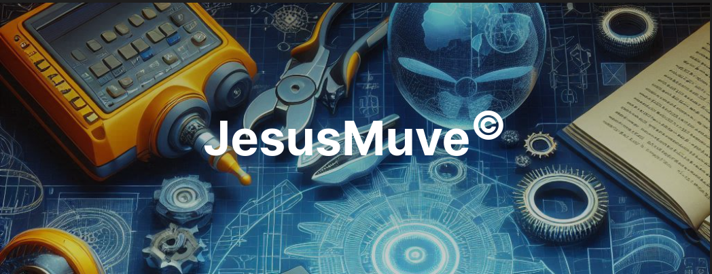

## Hi there, I'm JesusMuve 👋

<!--
**jesusmuve18/jesusmuve18** is a ✨ _special_ ✨ repository because its `README.md` (this file) appears on your GitHub profile.

Here are some ideas to get you started:

- 🔭 I’m currently working on ...
- 🌱 I’m currently learning ...
- 👯 I’m looking to collaborate on ...
- 🤔 I’m looking for help with ...
- 💬 Ask me about ...
- 📫 How to reach me: ...
- 😄 Pronouns: ...
- ⚡ Fun fact: ...
-->
### About me
- 💻 Computer Engineering Student
- 📚 Mathematics Student
- 🖥️ FrontEnd Developer
- 🧊 3D Designer
- 🎶 Music Developer
- 📫 How to reach me: <a href="mailto:jesumuve19@gmail.com" style="color: white; text-decoration: none;">jesumuve19@gmail.com</a>

## Languages I use:
<!--
- C/C++
- Python 🐍
- Java ☕
- Ruby 🔶
- HTML5
- CSS
- JavaScript
- bash
- LaTeX
-->

 
   <!-- C -->
   <!-- C++ -->
   <!-- Python -->
   <!-- Java -->
   <!-- Ruby -->
   <!-- HTML5 -->
   <!-- CSS -->
   <!-- JavaScript -->
   <!-- Bash -->
   <!-- LaTeX -->

## Tools I use:
<!--
- VSCode
- NetBeans
- CLion
- Overleaf
- Blender
- Ableton
- Guitar Pro
-->

 
   <!-- VSCode -->
   <!-- Netbeans -->
   <!-- CLion -->
   <!-- Overleaf -->
   <!-- Blender -->
   <!-- Ableton -->
   <!-- Guitar Pro -->

<!--p align="center"> 
  
</p-->

